<div align="center">

<h1>GeneMAN: Generalizable Single-Image 3D Human Reconstruction from Multi-Source Human Datas</h1>

<div>
    <a href="https://scholar.google.com.hk/citations?user=CX-o0V4AAAAJ&hl=zh-CN&oi=ao" target="_blank">Wentao Wang</a><sup>1*</sup>&emsp;
    <a href="https://alvinyh.github.io/" target="_blank">Hang Ye</a><sup>1*</sup>&emsp;
    <a href="https://hongfz16.github.io/" target="_blank">Fangzhou Hong</a><sup>3</sup>&emsp;
    <a href="https://yangxue0827.github.io/" target="_blank">Xue Yang</a><sup>1</sup>&emsp;
    <a href="https://scholar.google.com.hk/citations?hl=zh-CN&user=jSiStc4AAAAJ&view_op=list_works" target="_blank">Jianfu Zhang</a><sup>4</sup>&emsp;
    <a href="https://cfcs.pku.edu.cn/english/people/faculty/yizhouwang/index.htm" target="_blank">Yizhou Wang</a><sup>2</sup>&emsp;
    <a href='https://liuziwei7.github.io/' target='_blank'>Ziwei Liu</a><sup>3</sup>&emsp;
    <a href='https://scholar.google.com/citations?user=lSDISOcAAAAJ&hl=zh-CN' target='_blank'>Liang Pan</a><sup>1&dagger;</sup>&emsp;
</div>
<div>
    <sup>1</sup>Shanghai AI Laboratory&emsp; 
    <sup>2</sup>Peking University&emsp; 
    <sup>3</sup>Nanyang Technological University&emsp; 
    <sup>3</sup>Shanghai Jiao Tong University&emsp; 
    </br>
    <sup>*</sup>Equal Contribution
    <sup>&dagger;</sup>Corresponding Author
</div>


</div>


<table style="border-collapse: collapse;">
    <tr>
        <td style="padding: 0; margin: 0;">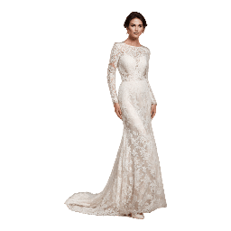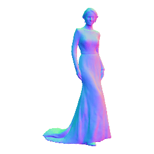</td>
        <!-- <td style="padding: 0; margin: 0;">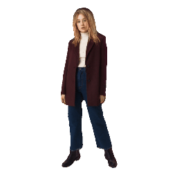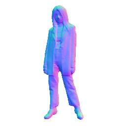</td> -->
        <!-- <td style="padding: 0; margin: 0;">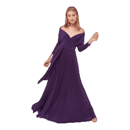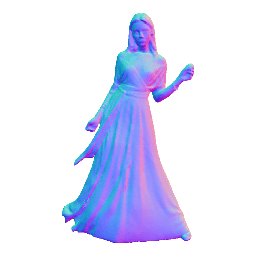</td> -->
        <td style="padding: 0; margin: 0;">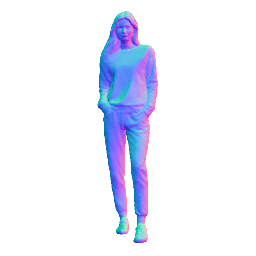</td>
        <td style="padding: 0; margin: 0;">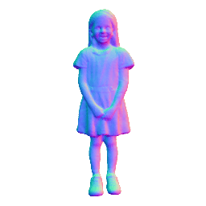</td>
        <td style="padding: 0; margin: 0;">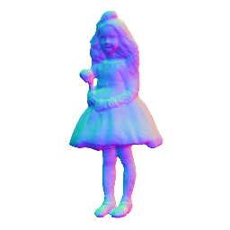</td>
        <td style="padding: 0; margin: 0;">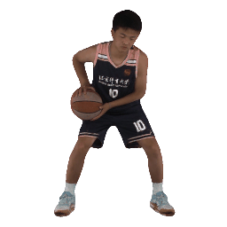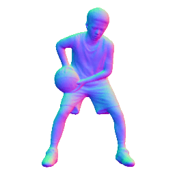</td>
        <td style="padding: 0; margin: 0;">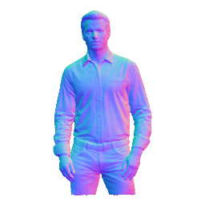</td>
        <!-- <td style="padding: 0; margin: 0;">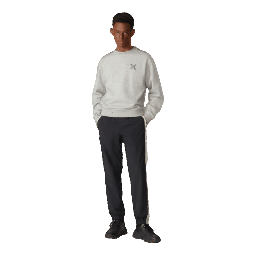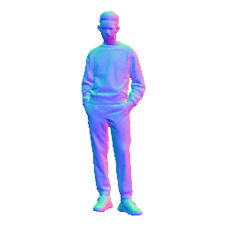</td> -->
        <td style="padding: 0; margin: 0;">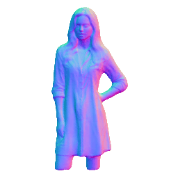</td>
        <td style="padding: 0; margin: 0;">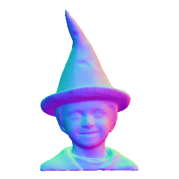</td>
        <td style="padding: 0; margin: 0;">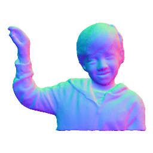</td>
    </tr>
</table>

GeneMAN is a generalizable framework for single-view-to-3D human reconstruction, built on a collection of multi-source human data. Given a single in-the-wild image of a person, GeneMAN could reconstruct a high-quality 3D human model, regardless of its clothing, pose, or body proportions (e.g., a full-body, a half-body, or a close-up shot) in the given image.

---

<div align="center">
<h4 align="center">
  <a href="https://roooooz.github.io/GeneMAN/" target='_blank'>[Project Page]</a> •
  <a href="http://arxiv.org/abs/2411.18624" target='_blank'>[arXiv]</a> •
  <a href="https://www.youtube.com/watch?v=bZRmLgoNVAI" target='_blank'>[Demo Video]</a> 
</h4>

</div>


## Citation

If you find this work useful for your research, please consider citing our paper:

```bibtex
@article{wang2024geneman,
  title={GeneMAN: Generalizable Single-Image 3D Human Reconstruction from Multi-Source Human Data},
  author={Wang, Wentao and Ye, Hang and Hong, Fangzhou and Yang, Xue and Zhang, Jianfu and Wang, Yizhou and Liu, Ziwei and Pan, Liang},
  journal={arXiv preprint arXiv:2411.18624},
  year={2024}
}
```
