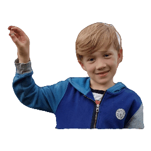

<div align="center">

<h1>GeneMAN: Generalizable Single-Image 3D Human Reconstruction from Multi-Source Human Datas</h1>

<div>
    <a href="https://scholar.google.com.hk/citations?user=CX-o0V4AAAAJ&hl=zh-CN&oi=ao" target="_blank">Wentao Wang</a><sup>1*</sup>&emsp;
    <a href="https://alvinyh.github.io/" target="_blank">Hang Ye</a><sup>2*</sup>&emsp;
    <a href="https://hongfz16.github.io/" target="_blank">Fangzhou Hong</a><sup>3</sup>&emsp;
    <a href="https://yangxue0827.github.io/" target="_blank">Xue Yang</a><sup>1</sup>&emsp;
    <a href="https://scholar.google.com.hk/citations?hl=zh-CN&user=jSiStc4AAAAJ&view_op=list_works" target="_blank">Jianfu Zhang</a><sup>4</sup>&emsp;
    <a href="https://cfcs.pku.edu.cn/english/people/faculty/yizhouwang/index.htm" target="_blank">Yizhou Wang</a><sup>2</sup>&emsp;
    <a href='https://liuziwei7.github.io/' target='_blank'>Ziwei Liu</a><sup>3</sup>&emsp;
    <a href='https://scholar.google.com/citations?user=lSDISOcAAAAJ&hl=zh-CN' target='_blank'>Liang Pan</a><sup>1&dagger;</sup>&emsp;
</div>
<div>
    <sup>1</sup>Shanghai AI Laboratory&emsp; 
    <sup>2</sup>Peking University&emsp; 
    <sup>3</sup>Nanyang Technological University&emsp; 
    <sup>3</sup>Shanghai Jiao Tong University&emsp; 
    </br>
    <sup>*</sup>Equal Contribution
    <sup>&dagger;</sup>Corresponding Author
</div>


</div>

<table style="border-collapse: collapse;">
    <tr>
        <td style="padding: 0; margin: 0;"></td>
        <!-- <td style="padding: 0; margin: 0;"></td>
        <td style="padding: 0; margin: 0;"></td> -->
        <td style="padding: 0; margin: 0;"></td>
        <td style="padding: 0; margin: 0;"></td>
        <td style="padding: 0; margin: 0;"></td>
        <td style="padding: 0; margin: 0;"></td>
        <td style="padding: 0; margin: 0;"></td>
        <!-- <td style="padding: 0; margin: 0;"></td> -->
        <td style="padding: 0; margin: 0;"></td>
        <td style="padding: 0; margin: 0;"></td>
        <td style="padding: 0; margin: 0;"></td>
    </tr>
</table>

GeneMAN is a generalizable framework for single-view-to-3D human reconstruction, built on a collection of multi-source human data. Given a single in-the-wild image of a person, GeneMAN could reconstruct a high-quality 3D human model, regardless of its clothing, pose, or body proportions (e.g., a full-body, a half-body, or a close-up shot) in the given image.

---

<div align="center">
<h4 align="center">
  <a href="https://roooooz.github.io/GeneMAN/" target='_blank'>[Project Page]</a> •
  <a href="http://arxiv.org/abs/2411.18624" target='_blank'>[arXiv]</a> •
  <a href="https://www.youtube.com/watch?v=bZRmLgoNVAI" target='_blank'>[Demo Video]</a> 
</h4>

</div>

## Installation

### Environment Setup

**This part is the same as original threestudio. Skip it if you already have installed the environment.**

See [installation.md](docs/installation.md) for additional information, including installation via Docker.

- You must have an NVIDIA graphics card with at least 20GB VRAM and have [CUDA](https://developer.nvidia.com/cuda-downloads) installed.
- Install `Python >= 3.8`.
- (Optional, Recommended) Create a virtual environment:

```bash
conda create -n geneman python==3.10
conda activate geneman
```

- Install `PyTorch >= 1.12`. We have tested on `torch1.12.1+cu113` and `torch2.0.0+cu118`, but other versions should also work fine.

```bash
# torch1.12.1+cu113
pip install torch==1.12.1+cu113 torchvision==0.13.1+cu113 --extra-index-url https://download.pytorch.org/whl/cu113
# or torch2.0.0+cu118
pip install torch torchvision --index-url https://download.pytorch.org/whl/cu118
```

- (Optional, Recommended) Install ninja to speed up the compilation of CUDA extensions:

```bash
pip install ninja
```

- Install dependencies:

```bash
git clone https://github.com/3DTopia/GeneMAN
cd GeneMAN
pip install -r requirements.txt
```

### Models

1. Download our pre-trained GeneMAN models from [HuggingFace](https://huggingface.co/datasets/wwt117/GeneMAN).  
Copy the `pretrained_models` folder into `GeneMAN/pretrained_models`.  Copy the `tets` folder into `GeneMAN/extern`.


2. Download [HumanNorm](https://github.com/xhuangcv/humannorm) pretrained models on HuggingFace: [Normal-adapted-model](https://huggingface.co/xanderhuang/normal-adapted-sd1.5/tree/main), [Depth-adapted-model](https://huggingface.co/xanderhuang/depth-adapted-sd1.5/tree/main), [Normal-aligned-model](https://huggingface.co/xanderhuang/normal-aligned-sd1.5/tree/main) and [ControlNet](https://huggingface.co/xanderhuang/controlnet-normal-sd1.5/tree/main). Place HumanNorm pretrained models into `GeneMAN/pretrained_models`. 


3. Download required model checkpoints for pre-processing:
  - For background removal, download [ViT-H SAM model](https://dl.fbaipublicfiles.com/segment_anything/sam_vit_h_4b8939.pth) to `GeneMAN/pretrained_models/seg`.
  - YOLO11, BLIP2 and Sapiens models will be downloaded automatically on first use.


After downloading, the GeneMAN folder is structured like:


```
GeneMAN/
├── extern/
│   └── tets/
├── pretrained_models/
│   ├── normal-adapted-sd1.5/
│   ├── depth-adapted-sd1.5/
│   ├── normal-aligned-sd1.5/
│   ├── controlnet-normal-sd1.5/
│   ├── geneman-prior2d/
│   ├── geneman-prior3d/
│   ├── sapiens/
│   └── seg/
│       ├── sam_vit_h_4b8939.pth
│       └── yolo11x.pt
└── …
```


## QuickStart

### Preprocessing
Pre-process the human images to remove background and obtain normals, depths, keypoints, and text prompts:

```bash
sh script/preprocess.sh
```

### Usage
Our model is trained in multiple stages. Run 3D human reconstruction from a single image:
```bash
sh script/run.sh
```
<details>
<summary>[Note]: We have now switched to the Stage-3 strategy proposed in <a href="https://github.com/xhuangcv/humannorm">HumanNorm</a>, based on our prior model.</summary>
In our original pipeline, the texture-refinement stage was carried out by refining the UV map. We observed that a small fraction of the results exhibited instability and visible artifacts introduced by our original UV-map texture refinement. As an alternative, we have now switched to the Stage-3 strategy proposed in HumanNorm.
If you would like to use UV map texture refine, you can refer to the Stage-3 scheme described in <a href="https://github.com/dreamgaussian/dreamgaussian">DreamGaussian</a>. We will further enhance this stage in future updates.
</details>


### Export Meshes
```bash
sh script/export_mesh.sh
```

### TODO
- [x] Release the code.
- [x] Upload pretrained models.
- [ ] Enhance texture refine stage.
 

## Acknowledgments

Our project benefits from the amazing open-source projects:


- [Diffusers](https://huggingface.co/docs/diffusers/index)
- [DreamCraft3D](https://github.com/deepseek-ai/DreamCraft3D)
- [DreamGaussian](https://github.com/dreamgaussian/dreamgaussian)
- [HumanNorm](https://github.com/xhuangcv/humannorm)
- [ThreeStudio](https://github.com/threestudio-project/threestudio)
- [Zero-1-to-3](https://github.com/cvlab-columbia/zero123)


We are grateful for their contribution.

## Citation

If you find this work useful for your research, please consider citing our paper:

```bibtex
@article{wang2024geneman,
  title={GeneMAN: Generalizable Single-Image 3D Human Reconstruction from Multi-Source Human Data},
  author={Wang, Wentao and Ye, Hang and Hong, Fangzhou and Yang, Xue and Zhang, Jianfu and Wang, Yizhou and Liu, Ziwei and Pan, Liang},
  journal={arXiv preprint arXiv:2411.18624},
  year={2024}
}
```

